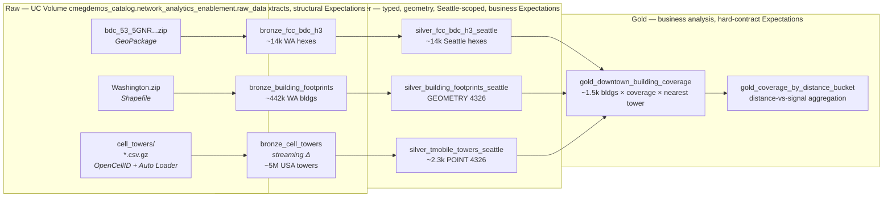

# Network Analytics — Bronze / Silver / Gold Pipeline

For architecture rationale, Expectations as implemented, event-log queries, and operational troubleshooting, see [detailed_readme.md](detailed_readme.md).

A **Lakeflow Spark Declarative Pipeline** (**SDP**) packaged as a
Declarative Automation Bundle (DAB). Official docs: [Lakeflow Spark Declarative Pipelines](https://docs.databricks.com/aws/en/ldp). Converts the existing `01_Ingest.ipynb`
extraction logic and the `02_Analysis.ipynb` join logic into a production
medallion pipeline with **Expectations highlighted at every layer** and a
**visible DAG**.

## Pipeline DAG



The Lakeflow pipeline UI auto-renders the same DAG once deployed, with green/red
borders on each node reflecting Expectation pass/fail counts for the most recent
update.

## Expectations at a glance

Three escalating severity levels per layer:

| Decorator                | Behavior                            | Used at | Purpose                                  |
| ------------------------ | ----------------------------------- | ------- | ---------------------------------------- |
| `@dp.expect()`           | Warn — bad rows pass through, count | Bronze  | Surface anomalies without blocking       |
| `@dp.expect_or_drop()`   | Drop bad rows, keep the run going   | Silver  | Cleansing / filtering business rules     |
| `@dp.expect_or_fail()`   | Fail the update                     | Gold    | Data contracts that must never be broken |

### Bronze — structural

| Dataset | Constraint | Action |
| --- | --- | --- |
| `bronze_fcc_bdc_h3` | `valid_fid: fid IS NOT NULL` | warn |
| `bronze_fcc_bdc_h3` | `parsable_h3: h3_isvalid(h3_res9_id)` | drop |
| `bronze_fcc_bdc_h3` | `known_technology: technology IS NOT NULL` | warn |
| `bronze_building_footprints` | `wkt_present: wkt IS NOT NULL` | drop |
| `bronze_building_footprints` | `polygon_format: wkt LIKE 'POLYGON%'` | drop |
| `bronze_building_footprints` | `non_negative_height: height IS NULL OR height >= 0` | warn |
| `bronze_cell_towers` | `non_null_cell: cell IS NOT NULL` | drop |
| `bronze_cell_towers` | `valid_mcc_310: mcc = 310` | drop |
| `bronze_cell_towers` | `valid_lat_lon: lat ∈ [-90,90] AND lon ∈ [-180,180]` | drop |

### Silver — business / geospatial

| Dataset | Constraint | Action |
| --- | --- | --- |
| `silver_fcc_bdc_h3_seattle` | `in_seattle_bbox` (centroid lat/lon) | drop |
| `silver_fcc_bdc_h3_seattle` | `known_5g_technology` | warn |
| `silver_fcc_bdc_h3_seattle` | `non_null_speeds` | warn |
| `silver_building_footprints_seattle` | `valid_geometry: ST_IsValid(geometry)` | drop |
| `silver_building_footprints_seattle` | `centroid_in_seattle_bbox` | drop |
| `silver_building_footprints_seattle` | `non_negative_height` | warn |
| `silver_tmobile_towers_seattle` | `tmobile_only: net = 260` | **fail** (sentinel) |
| `silver_tmobile_towers_seattle` | `point_geometry: ST_GeometryType(location) = 'ST_Point'` | **fail** (sentinel) |
| `silver_tmobile_towers_seattle` | `in_seattle_bbox` | drop |
| `silver_tmobile_towers_seattle` | `radius_positive` | warn |

### Gold — domain contracts

| Dataset | Constraint | Action |
| --- | --- | --- |
| `gold_downtown_building_coverage` | `non_negative_speeds` | **fail** |
| `gold_downtown_building_coverage` | `reasonable_distance: 0 ≤ d ≤ 50000m` | **fail** |
| `gold_downtown_building_coverage` | `valid_h3` | **fail** |
| `gold_downtown_building_coverage` | `has_nearest_tower` | drop |
| `gold_downtown_building_coverage` | `has_5g_coverage` | warn |
| `gold_coverage_by_distance_bucket` | `bucket_has_buildings: buildings > 0` | **fail** |
| `gold_coverage_by_distance_bucket` | `non_negative_avg_speed` | **fail** |
| `gold_coverage_by_distance_bucket` | `non_null_avg_speed` | warn |

These metrics surface in the **Data Quality** tab of the Lakeflow pipeline UI
per run, and are queryable from the pipeline event log:

```sql
SELECT
    timestamp,
    event_type,
    details:flow_progress.metrics.expectations.* AS expectation
FROM event_log(TABLE(<your-pipeline-id>))
WHERE event_type = 'flow_progress'
  AND details:flow_progress.metrics.expectations IS NOT NULL
ORDER BY timestamp DESC;
```

## Project layout

```
network_analytics_pipeline/
├── databricks.yml                        # DAB config (vars, targets dev/prod)
├── README.md                             # this file
├── AGENTS.md / CLAUDE.md                 # agent guidance
├── notebooks/
│   ├── demo_generate_cell_towers_shard.ipynb      # base Auto Loader shards → raw_data/cell_towers/
│   ├── demo_generate_ops_app_kpis_shard.ipynb     # ops KPI shards → raw_data/kpis/
│   └── demo_generate_ops_app_demand_shard.ipynb   # ops demand shards → raw_data/demand/
├── resources/
│   ├── network_analytics.pipeline.yml        # Base pipeline resource (serverless)
│   └── ops_app_network_analytics.pipeline.yml # Ops-app pipeline resource (serverless)
├── src/
    ├── bronze/
    │   ├── bronze_fcc_bdc_h3.py
    │   ├── bronze_building_footprints.py
    │   └── bronze_cell_towers.py
    ├── silver/
    │   ├── silver_fcc_bdc_h3_seattle.py
    │   ├── silver_building_footprints_seattle.py
    │   └── silver_tmobile_towers_seattle.py
    └── gold/
        ├── gold_downtown_building_coverage.py
        └── gold_coverage_by_distance_bucket.py
└── src_ops_app/
    ├── bronze/
    │   ├── ops_app_bronze_tower_hourly_kpis.py
    │   └── ops_app_bronze_building_hourly_demand.py
    ├── silver/
    │   ├── ops_app_silver_tower_kpis_latest.py
    │   └── ops_app_silver_building_demand_latest.py
    └── gold/
        └── ops_app_gold_downtown_building_coverage.py
```

## Tables produced

All tables are published to `cmegdemos_catalog.network_analytics_enablement`
(configurable via the `catalog` / `schema` bundle variables) with `bronze_` /
`silver_` / `gold_` prefixes so the existing notebook tables remain untouched.

## Run it

Pre-requisites: Databricks CLI installed, a profile authenticated, and the
volume `cmegdemos_catalog.network_analytics_enablement.raw_data` populated with
the FCC zip, `Washington.zip`, and **OpenCellID gzip CSV shards** under
`raw_data/cell_towers/` (see below). Zips may remain at the volume root; tower
CSVs use a dedicated subfolder for append-only Auto Loader ingestion.

```bash
cd network_analytics_pipeline

# 1. Validate
databricks bundle validate --profile fevm-cmegdemos

# 2. Deploy to the dev target
databricks bundle deploy -t dev --profile fevm-cmegdemos

# 3. Trigger an update
databricks bundle run network_analytics_pipeline -t dev --profile fevm-cmegdemos
```

The CLI prints the pipeline URL — open it to see the live DAG and the Data
Quality tab.

### Migration: `bronze_cell_towers` was a materialized view (older deploys)

Lakeflow SDP **cannot** change an existing dataset from **materialized view** to **streaming table** in place. If deploy/run fails with **`CANNOT_CHANGE_DATASET_TYPE`** / *Cannot change the dataset type of a pipeline table from MATERIALIZED_VIEW to STREAMING_TABLE*:

1. Run **`DROP TABLE`** on `bronze_cell_towers` in your target catalog/schema (see [scripts/drop_bronze_cell_towers_for_streaming_migration.sql](scripts/drop_bronze_cell_towers_for_streaming_migration.sql)). Adjust names if `catalog` / `schema` bundle variables differ.
2. **`databricks bundle deploy`** again, then **`databricks bundle run network_analytics_pipeline`**.

The next update recreates `bronze_cell_towers` as a streaming table and refreshes downstream nodes. Downstream tables (`silver_*`, `gold_*`) do not need to be dropped for this change.

## OpenCellID bronze (`bronze_cell_towers`) — Auto Loader

- **Where to land files:** `{raw_volume_path}/{cell_towers_incoming_subdir}/` (defaults to `.../raw_data/cell_towers/`). Configure `cell_towers_incoming_subdir` in [databricks.yml](databricks.yml) if you use a different folder name.
- **What to drop:** Headerless gzip CSVs in the same 14-column layout as historical `310.csv.gz`. Any file name is fine; use dated prefixes (e.g. `2026-05-05_310.csv.gz`) or nested folders — `pathGlobFilter` is `*.csv.gz` with `recursiveFileLookup` enabled.
- **Semantics:** Append-only incremental ingest: each pipeline update processes **new** files since the streaming checkpoint. Ad-hoc drops are picked up on the next run (pipeline `continuous: false` is fine).
- **Implementation:** `@dp.table()` + `spark.readStream.format("cloudFiles")` — see [Auto Loader](https://docs.databricks.com/aws/en/ingestion/auto-loader/index) and [SDP](https://docs.databricks.com/aws/en/ldp). Downstream silver still batch-reads `bronze_cell_towers` with `spark.read.table(...)`.
- **Demo notebook:** [notebooks/demo_generate_cell_towers_shard.ipynb](notebooks/demo_generate_cell_towers_shard.ipynb) — random sample gzip from `raw_data/310.csv.gz` → writes into **`raw_data/cell_towers/`** for Auto Loader.

## Ops-app pipeline (`ops_app_network_analytics_pipeline`)

The repo also includes an ops-enrichment pipeline that writes `ops_app_*` tables and merges into `ops_app_gold_downtown_building_coverage`.

- **Auto Loader inputs:**  
  - KPI shards: `{raw_volume_path}/{ops_app_kpis_incoming_subdir}/` (default `raw_data/kpis/`)  
  - Demand shards: `{raw_volume_path}/{ops_app_demand_incoming_subdir}/` (default `raw_data/demand/`)
- **Demo notebooks:**  
  - [notebooks/demo_generate_ops_app_kpis_shard.ipynb](notebooks/demo_generate_ops_app_kpis_shard.ipynb)  
  - [notebooks/demo_generate_ops_app_demand_shard.ipynb](notebooks/demo_generate_ops_app_demand_shard.ipynb)
- **Run:** `databricks bundle run ops_app_network_analytics_pipeline -t dev --profile fevm-cmegdemos`

### Migration note for ops_app bronze tables

If an older deployment created `ops_app_bronze_tower_hourly_kpis` / `ops_app_bronze_building_hourly_demand` as materialized views, switching to streaming Auto Loader tables requires a one-time drop first (same `CANNOT_CHANGE_DATASET_TYPE` rule). Use [scripts/drop_ops_app_bronze_for_streaming_migration.sql](scripts/drop_ops_app_bronze_for_streaming_migration.sql), then redeploy and rerun.

## Design notes

- **Mostly `@dp.materialized_view()` (batch)** for FCC and buildings: sources are static archives in a Volume, and Auto Loader does not natively read GeoPackage or Shapefile inside zips. A Python MV that extracts the zip is the cleanest 1:1 port of the existing notebook logic. On serverless, MVs get automatic incremental refresh where the operation supports it.
- **`bronze_cell_towers` is a streaming table** so OpenCellID shards can land incrementally under `cell_towers/` without rescanning prior drops.
- **Sentinel `expect_or_fail` checks**: the silver tower table filters on
  `net = 260` *and* asserts the same condition with `expect_or_fail`. The
  redundancy is intentional — if the upstream filter ever drifts, the contract
  trips immediately rather than silently writing other carriers under a name
  that says "T-Mobile".
- **`pyshp` + `pandas` dependencies** are declared in the pipeline `environment`
  block of [resources/network_analytics.pipeline.yml](resources/network_analytics.pipeline.yml)
  so they're installed automatically on the serverless pipeline workers.
- **Source-of-truth for the Seattle bbox** is duplicated across silver files;
  callers can change the constants at the top of each file. The downtown bbox
  for the gold layer is in `gold_downtown_building_coverage.py`.
