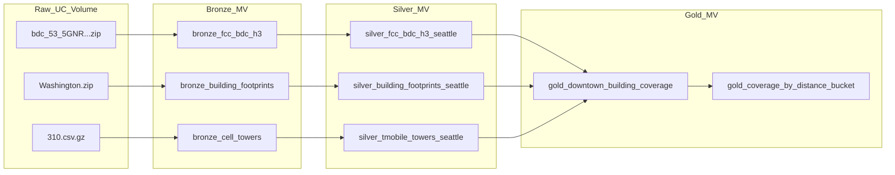

# Network Analytics Pipeline — Detailed Reference

This document expands on [README.md](README.md) with architecture rationale, layer-by-layer behavior, Expectations as implemented in code, operational runbooks, and known implementation details.

## Purpose

The bundle reproduces the intent of the repo notebooks:

- [../01_Ingest.ipynb](../01_Ingest.ipynb) — raw file extraction from a Unity Catalog volume into typed tables.
- [../02_Analysis.ipynb](../02_Analysis.ipynb) — downtown Seattle joins (H3 coverage, nearest tower, distance buckets).

Pipeline outputs use **`bronze_` / `silver_` / `gold_` table name prefixes** under the configured catalog and schema so existing notebook table names (for example `fcc_bdc_h3_seattle`, `downtown_seattle_building_coverage`) are not overwritten.

## Architecture (medallion + DAG)

The Lakeflow UI renders the same dependency graph after deploy. Offline, the flow is:



**Raw volume path (default):** `/Volumes/cmegdemos_catalog/network_analytics_enablement/raw_data`

Override via bundle variable `raw_volume_path` in [databricks.yml](databricks.yml); the pipeline passes it to workers as Spark config `pipeline.raw_volume_path`, read in Bronze Python with `spark.conf.get(...)`.

## Dataset types and APIs

- **Language:** Python only (Bronze must read GeoPackage via `sqlite3` and Shapefile via `pyshp`; Silver/Gold use Spark SQL).
- **Dataset kind:** `@dp.materialized_view()` everywhere — sources are static files on a Volume (batch), not a continuous stream.
- **Imports:** `from pyspark import pipelines as dp` (preferred over legacy `import dlt`).
- **Cross-dataset reads:** `spark.read.table("upstream_name")` or unqualified names inside `spark.sql(...)` that resolve to pipeline-published datasets in the pipeline catalog/schema.

## Tables produced (logical model)

| Layer | Table | Role |
| --- | --- | --- |
| Bronze | `bronze_fcc_bdc_h3` | All WA-state BDC H3 rows from GeoPackage (many rows per hex across providers/tech). |
| Bronze | `bronze_building_footprints` | WA building polygons as WKT + height. |
| Bronze | `bronze_cell_towers` | USA OpenCellID rows (MCC 310), typed columns. |
| Silver | `silver_fcc_bdc_h3_seattle` | Seattle bbox on H3 cell centers; adds `center_lat` / `center_lon`. |
| Silver | `silver_building_footprints_seattle` | `GEOMETRY(4326)`, `building_id`, centroid-in-Seattle-bbox filter. |
| Silver | `silver_tmobile_towers_seattle` | MNC 260, Seattle bbox, `ST_Point` as `location`. |
| Gold | `gold_downtown_building_coverage` | Downtown bbox buildings × BDC aggregate × nearest tower (matches notebook 02 shape). |
| Gold | `gold_coverage_by_distance_bucket` | Aggregated distance vs. signal for buildings with `best_download_mbps > 0`. |

**Bounding boxes in code**

- Seattle metro (Silver + tower/lat filters): `47.40–47.80` lat, `-122.50–-122.10` lon (see silver modules).
- Downtown core (Gold buildings): `47.595–47.625` lat, `-122.355–-122.325` lon (see [src/gold/gold_downtown_building_coverage.py](src/gold/gold_downtown_building_coverage.py)).

## Expectations — design vs. implementation

Severity levels:

| Decorator | Effect |
| --- | --- |
| `@dp.expect` | Warn; row retained; metrics in Data Quality. |
| `@dp.expect_or_drop` | Row dropped before write; run continues. |
| `@dp.expect_or_fail` | Violation fails the pipeline update. |

### Bronze (structural)

Implemented in [src/bronze/](src/bronze/):

| Dataset | Name | Constraint (summary) | Severity |
| --- | --- | --- | --- |
| `bronze_fcc_bdc_h3` | `valid_fid` | `fid IS NOT NULL` | warn |
| `bronze_fcc_bdc_h3` | `parsable_h3` | `h3_isvalid(h3_res9_id)` | drop |
| `bronze_fcc_bdc_h3` | `known_technology` | `technology IS NOT NULL` | warn |
| `bronze_building_footprints` | `wkt_present` | `wkt IS NOT NULL` | drop |
| `bronze_building_footprints` | `polygon_format` | `wkt LIKE 'POLYGON%'` | drop |
| `bronze_building_footprints` | `non_negative_height` | `height IS NULL OR height >= 0` | warn |
| `bronze_cell_towers` | `non_null_cell` | `cell IS NOT NULL` | drop |
| `bronze_cell_towers` | `valid_mcc_310` | `mcc = 310` | drop |
| `bronze_cell_towers` | `valid_lat_lon` | lat/lon in valid ranges | drop |

### Silver (geospatial / business)

| Dataset | Name | Constraint (summary) | Severity |
| --- | --- | --- | --- |
| `silver_fcc_bdc_h3_seattle` | `in_seattle_bbox` | Cell center inside Seattle metro bbox | drop |
| `silver_fcc_bdc_h3_seattle` | `known_5g_technology` | `technology IS NOT NULL` | warn |
| `silver_fcc_bdc_h3_seattle` | `non_null_speeds` | `mindown` / `minup` not null | warn |
| `silver_building_footprints_seattle` | `valid_geometry` | `ST_IsValid(geometry)` | drop |
| `silver_building_footprints_seattle` | `centroid_in_seattle_bbox` | Building centroid in Seattle metro bbox | drop |
| `silver_building_footprints_seattle` | `non_negative_height` | height null or ≥ 0 | warn |
| `silver_tmobile_towers_seattle` | `tmobile_only` | `net = 260` | **fail** |
| `silver_tmobile_towers_seattle` | `point_geometry` | `ST_GeometryType(location) = 'ST_Point'` | **fail** |
| `silver_tmobile_towers_seattle` | `in_seattle_bbox` | lat/lon in Seattle metro bbox | drop |
| `silver_tmobile_towers_seattle` | `radius_positive` | radius null or > 0 | warn |

**Note on `point_geometry`:** Databricks `ST_GeometryType` returns the string **`ST_Point`** for point geometries, not `POINT`. Using `'POINT'` will false-fail valid rows.

**Plan delta:** An earlier design mentioned `technology IN (300, 400)` as a strict 5G filter and a polygon-intersection warn on buildings. The shipped code uses bbox + null checks on `technology` and speeds instead; tighten filters here if you need exact NR-only semantics.

### Gold (contracts)

| Dataset | Name | Constraint (summary) | Severity |
| --- | --- | --- | --- |
| `gold_downtown_building_coverage` | `non_negative_speeds` | Download/upload Mbps ≥ 0 | **fail** |
| `gold_downtown_building_coverage` | `reasonable_distance` | Distance 0–50 km | **fail** |
| `gold_downtown_building_coverage` | `valid_h3` | `h3_isvalid(h3_res9_id)` | **fail** |
| `gold_downtown_building_coverage` | `has_nearest_tower` | `nearest_tower_id IS NOT NULL` | drop |
| `gold_downtown_building_coverage` | `has_5g_coverage` | `best_download_mbps > 0` | warn |
| `gold_coverage_by_distance_bucket` | `bucket_has_buildings` | `buildings > 0` | **fail** |
| `gold_coverage_by_distance_bucket` | `non_negative_avg_speed` | `avg_download_mbps >= 0` | **fail** |
| `gold_coverage_by_distance_bucket` | `non_null_avg_speed` | avg speed not null | warn |

## Data Quality and event log

In the workspace: open the pipeline → **Graph** (DAG) and **Data Quality** (per-expectation counts).

Example pattern for recent flow progress (replace `<pipeline_id>` with your pipeline’s UUID from the URL):

```sql
SELECT
    timestamp,
    event_type,
    message,
    details:flow_progress.metrics.num_output_rows AS output_rows,
    details:flow_progress.data_quality.dropped_records AS dropped_records,
    details:flow_progress.data_quality AS data_quality
FROM event_log('<pipeline_id>')
WHERE event_type = 'flow_progress'
  AND message LIKE '%COMPLETED%'
ORDER BY timestamp DESC
LIMIT 50;
```

Dropped row counts on Silver reflect `expect_or_drop` on bbox and validity (often large versus Bronze row counts — that is expected).

## Bundle configuration

- [databricks.yml](databricks.yml) — `bundle.name`, `include: resources/*.yml`, variables (`catalog`, `schema`, `raw_volume_path`), targets `dev` / `prod`.
- [resources/network_analytics.pipeline.yml](resources/network_analytics.pipeline.yml) — `serverless: true`, `photon: true`, `libraries` glob for `../src/**`, `configuration` keys `pipeline.catalog`, `pipeline.schema`, `pipeline.raw_volume_path`, `environment.dependencies` (`pyshp`, `pandas`).

## Operational runbook

**Prerequisites**

- Databricks CLI installed and authenticated (`databricks auth profiles` shows `Valid: YES` for your profile).
- If `DATABRICKS_TOKEN` is set in the shell, it can override profile OAuth; unset it when debugging “invalid refresh token” while the profile is fresh.
- Volume contains the three source files expected by Bronze (names are hard-coded in the Bronze modules).

**Standard loop**

```bash
cd network_analytics_pipeline

databricks bundle validate --profile <profile>
databricks bundle deploy -t dev --profile <profile>
databricks bundle run network_analytics_pipeline -t dev --profile <profile>
```

**Selective refresh** (after changing only Gold, for example):

```bash
databricks bundle run network_analytics_pipeline \
  --refresh gold_downtown_building_coverage \
  --refresh gold_coverage_by_distance_bucket \
  -t dev --profile <profile>
```

## CLI and Terraform notes (older Databricks CLI)

On some CLI versions (for example **v0.288.0**), `bundle deploy` may try to download Terraform and fail OpenPGP verification (`key expired`). If a compatible Terraform binary is already installed, you can pin it:

```bash
export DATABRICKS_TF_EXEC_PATH=/opt/homebrew/bin/terraform   # or your terraform path
export DATABRICKS_TF_VERSION=1.9.1                             # must match local terraform major.minor
databricks bundle deploy -t dev --profile <profile>
```

Upgrading the Databricks CLI to a current release (see Databricks docs) removes the need for this workaround in most environments.

## Implementation lessons (read before changing Gold)

1. **`ST_GeometryType` and points:** Use `'ST_Point'`, not `'POINT'`, in Expectations on `ST_Point(...)` columns.
2. **Gold SQL and temp views:** Building `createOrReplaceTempView` in a pipeline MV and then querying those names in the same function can yield **zero output rows** in the pipeline runtime even when the same SQL works in a notebook. The shipped Gold MV uses **direct table names** (`silver_fcc_bdc_h3_seattle`, etc.) inside `spark.sql(...)`.
3. **`monotonically_increasing_id`:** Silver `building_id` / `tower_id` are not stable keys across unrelated full rewrites of Bronze; for idempotent keys, consider hashing natural keys or ingesting source IDs.
4. **Row counts:** Bronze FCC table row counts are **much larger** than unique H3 cells (multiple provider/technology rows per hex). Silver drops non-Seattle and invalid rows; event log `dropped_records` can be in the millions while the pipeline is healthy.

## File map

| Path | Responsibility |
| --- | --- |
| [src/bronze/bronze_fcc_bdc_h3.py](src/bronze/bronze_fcc_bdc_h3.py) | Zip → GeoPackage → pandas → Spark; FCC expectations |
| [src/bronze/bronze_building_footprints.py](src/bronze/bronze_building_footprints.py) | Zip → shapefile → WKT rows; footprint expectations |
| [src/bronze/bronze_cell_towers.py](src/bronze/bronze_cell_towers.py) | Gzipped CSV via Spark; OpenCellID expectations |
| [src/silver/silver_fcc_bdc_h3_seattle.py](src/silver/silver_fcc_bdc_h3_seattle.py) | H3 center lat/lon + Seattle bbox |
| [src/silver/silver_building_footprints_seattle.py](src/silver/silver_building_footprints_seattle.py) | WKT → `GEOMETRY(4326)` + bbox |
| [src/silver/silver_tmobile_towers_seattle.py](src/silver/silver_tmobile_towers_seattle.py) | T-Mobile + `ST_Point` |
| [src/gold/gold_downtown_building_coverage.py](src/gold/gold_downtown_building_coverage.py) | Downtown join + nearest tower |
| [src/gold/gold_coverage_by_distance_bucket.py](src/gold/gold_coverage_by_distance_bucket.py) | Distance buckets vs. signal |

For a short overview and the same Mermaid diagram, see [README.md](README.md).
