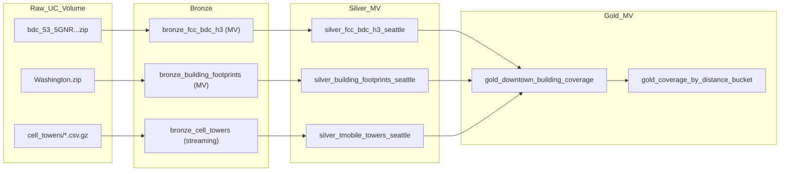
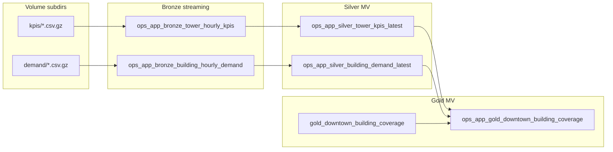

# Network Analytics Pipeline — Detailed Reference

This document expands on [README.md](README.md) with architecture rationale, layer-by-layer behavior, Expectations as implemented in code, operational runbooks, and known implementation details.

**Platform:** [Lakeflow Spark Declarative Pipelines (SDP)](https://docs.databricks.com/aws/en/ldp).

## Purpose

The bundle reproduces the intent of the repo notebooks:

- [../01_Ingest.ipynb](../01_Ingest.ipynb) — raw file extraction from a Unity Catalog volume into typed tables.
- [../02_Analysis.ipynb](../02_Analysis.ipynb) — downtown Seattle joins (H3 coverage, nearest tower, distance buckets).

Pipeline outputs use **`bronze_` / `silver_` / `gold_` table name prefixes** under the configured catalog and schema so existing notebook table names (for example `fcc_bdc_h3_seattle`, `downtown_seattle_building_coverage`) are not overwritten.

## Architecture (medallion + DAG)

The Lakeflow UI renders the same dependency graph after deploy. Offline, the flow is:



**Raw volume path (default):** `/Volumes/cmegdemos_catalog/network_analytics_enablement/raw_data`

Override via bundle variable `raw_volume_path` in [databricks.yml](databricks.yml); the pipeline passes it to workers as Spark config `pipeline.raw_volume_path`, read in Bronze Python with `spark.conf.get(...)`.

**OpenCellID incoming folder:** gzip CSV shards (append-only) must live under `{raw_volume_path}/{cell_towers_incoming_subdir}/` (default subdir `cell_towers`). Override with bundle variable `cell_towers_incoming_subdir` → `pipeline.cell_towers_incoming_subdir`.

**Ops-app incoming folders (second bundle):** gzip CSV shards under `{raw_volume_path}/{ops_app_kpis_incoming_subdir}/` (default **`kpis`**) and `{raw_volume_path}/{ops_app_demand_incoming_subdir}/` (default **`demand`**). Variables in [databricks.yml](databricks.yml) map to Spark conf **`pipeline.ops_app_kpis_incoming_subdir`** / **`pipeline.ops_app_demand_incoming_subdir`**.

### Ops-app DAG (`ops_app_network_analytics_pipeline`)

Independent Lakeflow SDP resource; **reads** **`gold_downtown_building_coverage`** from the same **`catalog` / `schema`** as the bundle variables (that gold table must exist before **`ops_app_gold_downtown_building_coverage`** can populate).



## Dataset types and APIs

- **Language:** Python only (Bronze must read GeoPackage via `sqlite3` and Shapefile via `pyshp`; Silver/Gold use Spark SQL).
- **Dataset kind:** `@dp.materialized_view()` for FCC and buildings (batch extracts from zips). **`bronze_cell_towers`** is a **`@dp.table()` streaming table** fed by Auto Loader (`cloudFiles`) for append-only gzip CSV drops under `cell_towers/`.
- **Ops-app bundle:** **`ops_app_bronze_tower_hourly_kpis`** and **`ops_app_bronze_building_hourly_demand`** are **`@dp.table()` streaming tables** (Auto Loader on **`kpis/`** and **`demand/`**). Silver and gold ops datasets are **`@dp.materialized_view()`**.
- **Imports:** `from pyspark import pipelines as dp` per [SDP development](https://docs.databricks.com/aws/en/ldp/developer); do not use the deprecated `dlt` Python package in new code.
- **Cross-dataset reads:** `spark.read.table("upstream_name")` or unqualified names inside `spark.sql(...)` that resolve to pipeline-published datasets in the pipeline catalog/schema.

## Tables produced (logical model)

| Layer | Table | Role |
| --- | --- | --- |
| Bronze | `bronze_fcc_bdc_h3` | All WA-state BDC H3 rows from GeoPackage (many rows per hex across providers/tech). |
| Bronze | `bronze_building_footprints` | WA building polygons as WKT + height. |
| Bronze | `bronze_cell_towers` | USA OpenCellID rows (MCC 310), typed columns; Auto Loader incremental ingest from `*.csv.gz` under the configured incoming subfolder. |
| Silver | `silver_fcc_bdc_h3_seattle` | Seattle bbox on H3 cell centers; adds `center_lat` / `center_lon`. |
| Silver | `silver_building_footprints_seattle` | `GEOMETRY(4326)`, `building_id`, centroid-in-Seattle-bbox filter. |
| Silver | `silver_tmobile_towers_seattle` | MNC 260, Seattle bbox, `ST_Point` as `location`. |
| Gold | `gold_downtown_building_coverage` | Downtown bbox buildings × BDC aggregate × nearest tower (matches notebook 02 shape). |
| Gold | `gold_coverage_by_distance_bucket` | Aggregated distance vs. signal for buildings with `best_download_mbps > 0`. |

**Ops-app bundle (same catalog/schema)**

| Layer | Table | Role |
| --- | --- | --- |
| Bronze | `ops_app_bronze_tower_hourly_kpis` | Streaming ingest of headerless KPI CSV.gz (`tower_id`, `event_ts`, utilization, latency, loss, throughput). |
| Bronze | `ops_app_bronze_building_hourly_demand` | Streaming ingest of headerless demand CSV.gz (`building_id`, `event_ts`, users, `traffic_mix`, indoor penetration). |
| Silver | `ops_app_silver_tower_kpis_latest` | Latest KPI row per `tower_id`; derives **`tower_health_band`** (`critical` / `watch` / `healthy`). |
| Silver | `ops_app_silver_building_demand_latest` | Latest demand row per `building_id`; derives **`effective_radio_load_score`**. |
| Gold | `ops_app_gold_downtown_building_coverage` | Baseline **`gold_downtown_building_coverage`** LEFT JOIN demand on **`building_id`** and KPI on **`nearest_tower_id`**; adds **`building_service_risk_band`**. |

**Bounding boxes in code**

- Seattle metro (Silver + tower/lat filters): `47.40–47.80` lat, `-122.50–-122.10` lon (see silver modules).
- Downtown core (Gold buildings): `47.595–47.625` lat, `-122.355–-122.325` lon (see [src/gold/gold_downtown_building_coverage.py](src/gold/gold_downtown_building_coverage.py)).

## Expectations — design vs. implementation

Severity levels:

| Decorator | Effect |
| --- | --- |
| `@dp.expect` | Warn; row retained; metrics in Data Quality. |
| `@dp.expect_or_drop` | Row dropped before write; run continues. |
| `@dp.expect_or_fail` | Violation fails the pipeline update. |

### Bronze (structural)

Implemented in [src/bronze/](src/bronze/):

| Dataset | Name | Constraint (summary) | Severity |
| --- | --- | --- | --- |
| `bronze_fcc_bdc_h3` | `valid_fid` | `fid IS NOT NULL` | warn |
| `bronze_fcc_bdc_h3` | `parsable_h3` | `h3_isvalid(h3_res9_id)` | drop |
| `bronze_fcc_bdc_h3` | `known_technology` | `technology IS NOT NULL` | warn |
| `bronze_building_footprints` | `wkt_present` | `wkt IS NOT NULL` | drop |
| `bronze_building_footprints` | `polygon_format` | `wkt LIKE 'POLYGON%'` | drop |
| `bronze_building_footprints` | `non_negative_height` | `height IS NULL OR height >= 0` | warn |
| `bronze_cell_towers` | `non_null_cell` | `cell IS NOT NULL` | drop |
| `bronze_cell_towers` | `valid_mcc_310` | `mcc = 310` | drop |
| `bronze_cell_towers` | `valid_lat_lon` | lat/lon in valid ranges | drop |

### Silver (geospatial / business)

| Dataset | Name | Constraint (summary) | Severity |
| --- | --- | --- | --- |
| `silver_fcc_bdc_h3_seattle` | `in_seattle_bbox` | Cell center inside Seattle metro bbox | drop |
| `silver_fcc_bdc_h3_seattle` | `known_5g_technology` | `technology IS NOT NULL` | warn |
| `silver_fcc_bdc_h3_seattle` | `non_null_speeds` | `mindown` / `minup` not null | warn |
| `silver_building_footprints_seattle` | `valid_geometry` | `ST_IsValid(geometry)` | drop |
| `silver_building_footprints_seattle` | `centroid_in_seattle_bbox` | Building centroid in Seattle metro bbox | drop |
| `silver_building_footprints_seattle` | `non_negative_height` | height null or ≥ 0 | warn |
| `silver_tmobile_towers_seattle` | `tmobile_only` | `net = 260` | **fail** |
| `silver_tmobile_towers_seattle` | `point_geometry` | `ST_GeometryType(location) = 'ST_Point'` | **fail** |
| `silver_tmobile_towers_seattle` | `in_seattle_bbox` | lat/lon in Seattle metro bbox | drop |
| `silver_tmobile_towers_seattle` | `radius_positive` | radius null or > 0 | warn |

**Note on `point_geometry`:** Databricks `ST_GeometryType` returns the string **`ST_Point`** for point geometries, not `POINT`. Using `'POINT'` will false-fail valid rows.

**Plan delta:** An earlier design mentioned `technology IN (300, 400)` as a strict 5G filter and a polygon-intersection warn on buildings. The shipped code uses bbox + null checks on `technology` and speeds instead; tighten filters here if you need exact NR-only semantics.

### Gold (contracts)

| Dataset | Name | Constraint (summary) | Severity |
| --- | --- | --- | --- |
| `gold_downtown_building_coverage` | `non_negative_speeds` | Download/upload Mbps ≥ 0 | **fail** |
| `gold_downtown_building_coverage` | `reasonable_distance` | Distance 0–50 km | **fail** |
| `gold_downtown_building_coverage` | `valid_h3` | `h3_isvalid(h3_res9_id)` | **fail** |
| `gold_downtown_building_coverage` | `has_nearest_tower` | `nearest_tower_id IS NOT NULL` | drop |
| `gold_downtown_building_coverage` | `has_5g_coverage` | `best_download_mbps > 0` | warn |
| `gold_coverage_by_distance_bucket` | `bucket_has_buildings` | `buildings > 0` | **fail** |
| `gold_coverage_by_distance_bucket` | `non_negative_avg_speed` | `avg_download_mbps >= 0` | **fail** |
| `gold_coverage_by_distance_bucket` | `non_null_avg_speed` | avg speed not null | warn |

### Ops-app expectations

Implemented under [src_ops_app/](src_ops_app/):

**Bronze**

| Dataset | Name | Constraint (summary) | Severity |
| --- | --- | --- | --- |
| `ops_app_bronze_tower_hourly_kpis` | `tower_id_not_null` | `tower_id IS NOT NULL` | drop |
| `ops_app_bronze_tower_hourly_kpis` | `utilization_in_bounds` | `prb_utilization_pct` between 0 and 100 | drop |
| `ops_app_bronze_tower_hourly_kpis` | `latency_positive` | `latency_ms > 0` | drop |
| `ops_app_bronze_building_hourly_demand` | `building_id_not_null` | `building_id IS NOT NULL` | drop |
| `ops_app_bronze_building_hourly_demand` | `non_negative_demand_users` | `demand_users >= 0` | drop |
| `ops_app_bronze_building_hourly_demand` | `indoor_penetration_in_range` | factor between 0.4 and 1.0 | drop |

**Silver**

| Dataset | Name | Constraint (summary) | Severity |
| --- | --- | --- | --- |
| `ops_app_silver_tower_kpis_latest` | `valid_utilization` | utilization 0–100 | drop |
| `ops_app_silver_tower_kpis_latest` | `valid_packet_loss` | loss 0–100 | drop |
| `ops_app_silver_tower_kpis_latest` | `valid_throughput` | throughput ≥ 0 | drop |
| `ops_app_silver_building_demand_latest` | `valid_demand_users` | users ≥ 0 | drop |
| `ops_app_silver_building_demand_latest` | `valid_mix` | `traffic_mix IN ('video_heavy','commute','balanced')` | warn |

**Gold**

| Dataset | Name | Constraint (summary) | Severity |
| --- | --- | --- | --- |
| `ops_app_gold_downtown_building_coverage` | `non_negative_download` | `best_download_mbps >= 0` | fail |
| `ops_app_gold_downtown_building_coverage` | `has_building_id` | `building_id IS NOT NULL` | drop |
| `ops_app_gold_downtown_building_coverage` | `has_nearest_tower` | `nearest_tower_id IS NOT NULL` | drop |

## Data Quality and event log

In the workspace: open the pipeline → **Graph** (DAG) and **Data Quality** (per-expectation counts).

Example pattern for recent flow progress (replace `<pipeline_id>` with your pipeline’s UUID from the URL):

```sql
SELECT
    timestamp,
    event_type,
    message,
    details:flow_progress.metrics.num_output_rows AS output_rows,
    details:flow_progress.data_quality.dropped_records AS dropped_records,
    details:flow_progress.data_quality AS data_quality
FROM event_log('<pipeline_id>')
WHERE event_type = 'flow_progress'
  AND message LIKE '%COMPLETED%'
ORDER BY timestamp DESC
LIMIT 50;
```

Dropped row counts on Silver reflect `expect_or_drop` on bbox and validity (often large versus Bronze row counts — that is expected).

## Bundle configuration

- [databricks.yml](databricks.yml) — `bundle.name`, `include: resources/*.yml`, variables (`catalog`, `schema`, `raw_volume_path`, `cell_towers_incoming_subdir`, `ops_app_kpis_incoming_subdir`, `ops_app_demand_incoming_subdir`), targets `dev` / `prod`.
- [resources/network_analytics.pipeline.yml](resources/network_analytics.pipeline.yml) — `serverless: true`, `photon: true`, `libraries` glob for `../src/**`, `configuration` keys `pipeline.catalog`, `pipeline.schema`, `pipeline.raw_volume_path`, `pipeline.cell_towers_incoming_subdir`, `environment.dependencies` (`pyshp`, `pandas`).
- [resources/ops_app_network_analytics.pipeline.yml](resources/ops_app_network_analytics.pipeline.yml) — `libraries` glob for `../src_ops_app/**`; reads Auto Loader subdirs `kpis/` and `demand/` via `pipeline.ops_app_kpis_incoming_subdir` / `pipeline.ops_app_demand_incoming_subdir`.

## Operational runbook

**`CANNOT_CHANGE_DATASET_TYPE` on `bronze_cell_towers`**

If this table was ever deployed as a **materialized view** and the code now defines it as a **streaming table** (`@dp.table` + Auto Loader), SDP rejects the update until the old object is removed. Run `DROP TABLE` on `bronze_cell_towers` in the pipeline catalog/schema (template: [scripts/drop_bronze_cell_towers_for_streaming_migration.sql](scripts/drop_bronze_cell_towers_for_streaming_migration.sql)), then redeploy and run the pipeline.

**`CANNOT_CHANGE_DATASET_TYPE` on `ops_app_bronze_*`**

If ops-app bronze tables were previously materialized views, drop them once before running the converted streaming definitions (template: [scripts/drop_ops_app_bronze_for_streaming_migration.sql](scripts/drop_ops_app_bronze_for_streaming_migration.sql)).

**Prerequisites**

- Databricks CLI installed and authenticated (`databricks auth profiles` shows `Valid: YES` for your profile).
- If `DATABRICKS_TOKEN` is set in the shell, it can override profile OAuth; unset it when debugging “invalid refresh token” while the profile is fresh.
- Volume contains the FCC zip and `Washington.zip` at the paths expected by the two batch Bronze MVs.
- OpenCellID: at least one headerless `*.csv.gz` under `{raw_volume_path}/{cell_towers_incoming_subdir}/` (default `.../raw_data/cell_towers/`). Additional dated files are ingested append-only on subsequent pipeline updates.
- Ops-app KPI feed: at least one headerless `*.csv.gz` under `{raw_volume_path}/{ops_app_kpis_incoming_subdir}/` (default `.../raw_data/kpis/`).
- Ops-app demand feed: at least one headerless `*.csv.gz` under `{raw_volume_path}/{ops_app_demand_incoming_subdir}/` (default `.../raw_data/demand/`).

**Standard loop**

```bash
cd network_analytics_pipeline

databricks bundle validate --profile <profile>
databricks bundle deploy -t dev --profile <profile>
databricks bundle run network_analytics_pipeline -t dev --profile <profile>
```

**Ops overlay loop** (after base gold exists; drop KPI/demand gz shards into the volume or run the demo notebooks in `notebooks/`):

```bash
cd network_analytics_pipeline

databricks bundle deploy -t dev --profile <profile>
databricks bundle run ops_app_network_analytics_pipeline -t dev --profile <profile>
```

The ops pipeline depends on **`gold_downtown_building_coverage`** already present in the target catalog/schema. Demo generators require **`silver_tmobile_towers_seattle`** (KPI) and **`gold_downtown_building_coverage`** (demand IDs / heights).

**Selective refresh** (after changing only Gold, for example):

```bash
databricks bundle run network_analytics_pipeline \
  --refresh gold_downtown_building_coverage \
  --refresh gold_coverage_by_distance_bucket \
  -t dev --profile <profile>
```

## CLI and Terraform notes (older Databricks CLI)

On some CLI versions (for example **v0.288.0**), `bundle deploy` may try to download Terraform and fail OpenPGP verification (`key expired`). If a compatible Terraform binary is already installed, you can pin it:

```bash
export DATABRICKS_TF_EXEC_PATH=/opt/homebrew/bin/terraform   # or your terraform path
export DATABRICKS_TF_VERSION=1.9.1                             # must match local terraform major.minor
databricks bundle deploy -t dev --profile <profile>
```

Upgrading the Databricks CLI to a current release (see Databricks docs) removes the need for this workaround in most environments.

## Implementation lessons (read before changing Gold)

1. **`ST_GeometryType` and points:** Use `'ST_Point'`, not `'POINT'`, in Expectations on `ST_Point(...)` columns.
2. **Gold SQL and temp views:** Building `createOrReplaceTempView` in a pipeline MV and then querying those names in the same function can yield **zero output rows** in the pipeline runtime even when the same SQL works in a notebook. The shipped Gold MV uses **direct table names** (`silver_fcc_bdc_h3_seattle`, etc.) inside `spark.sql(...)`.
3. **`monotonically_increasing_id`:** Silver `building_id` / `tower_id` are not stable keys across unrelated full rewrites of Bronze; for idempotent keys, consider hashing natural keys or ingesting source IDs.
4. **Row counts:** Bronze FCC table row counts are **much larger** than unique H3 cells (multiple provider/technology rows per hex). Silver drops non-Seattle and invalid rows; event log `dropped_records` can be in the millions while the pipeline is healthy.
5. **OpenCellID path change:** The bundle pipeline no longer reads `310.csv.gz` from the volume root. Copy or sync shards into `raw_data/cell_towers/` (or your configured `cell_towers_incoming_subdir`) before running the pipeline.

## File map

| Path | Responsibility |
| --- | --- |
| [src/bronze/bronze_fcc_bdc_h3.py](src/bronze/bronze_fcc_bdc_h3.py) | Zip → GeoPackage → pandas → Spark; FCC expectations |
| [src/bronze/bronze_building_footprints.py](src/bronze/bronze_building_footprints.py) | Zip → shapefile → WKT rows; footprint expectations |
| [src/bronze/bronze_cell_towers.py](src/bronze/bronze_cell_towers.py) | Auto Loader (`cloudFiles`) streaming ingest of gzip CSV shards; OpenCellID expectations |
| [src_ops_app/bronze/ops_app_bronze_tower_hourly_kpis.py](src_ops_app/bronze/ops_app_bronze_tower_hourly_kpis.py) | Auto Loader (`cloudFiles`) streaming ingest of ops KPI shards from `raw_data/kpis/` |
| [src_ops_app/bronze/ops_app_bronze_building_hourly_demand.py](src_ops_app/bronze/ops_app_bronze_building_hourly_demand.py) | Auto Loader (`cloudFiles`) streaming ingest of ops demand shards from `raw_data/demand/` |
| [notebooks/demo_generate_ops_app_kpis_shard.ipynb](notebooks/demo_generate_ops_app_kpis_shard.ipynb) | Writes KPI gz shards to **`kpis/`**; **`tower_id`** from **`silver_tmobile_towers_seattle`**; synthetic metrics seeded from **`310.csv.gz`**. |
| [notebooks/demo_generate_ops_app_demand_shard.ipynb](notebooks/demo_generate_ops_app_demand_shard.ipynb) | Writes demand gz shards to **`demand/`**; **`building_id`** / height from **`gold_downtown_building_coverage`**; synthetic demand seeded from **`310.csv.gz`**. |
| [src/silver/silver_fcc_bdc_h3_seattle.py](src/silver/silver_fcc_bdc_h3_seattle.py) | H3 center lat/lon + Seattle bbox |
| [src/silver/silver_building_footprints_seattle.py](src/silver/silver_building_footprints_seattle.py) | WKT → `GEOMETRY(4326)` + bbox |
| [src/silver/silver_tmobile_towers_seattle.py](src/silver/silver_tmobile_towers_seattle.py) | T-Mobile + `ST_Point` |
| [src/gold/gold_downtown_building_coverage.py](src/gold/gold_downtown_building_coverage.py) | Downtown join + nearest tower |
| [src/gold/gold_coverage_by_distance_bucket.py](src/gold/gold_coverage_by_distance_bucket.py) | Distance buckets vs. signal |
| [scripts/drop_bronze_cell_towers_for_streaming_migration.sql](scripts/drop_bronze_cell_towers_for_streaming_migration.sql) | One-time drop template when **`bronze_cell_towers`** MV → streaming |
| [scripts/drop_ops_app_bronze_for_streaming_migration.sql](scripts/drop_ops_app_bronze_for_streaming_migration.sql) | One-time drop template when **`ops_app_bronze_*`** MV → streaming |

For a short overview and the main Mermaid diagram, see [README.md](README.md).
